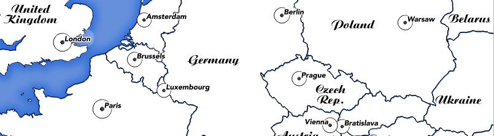

# Expressions in Context

“Expressions are a core component of QGIS. They let you define rules to govern just
about ever aspect of QGIS behaviour.”

In this module we will introduce the concept of expressions. If you ever created a
spreadsheet formula, you should be on familiar ground here. Expressions are one of the
most powerful features of QGIS. You can use them to control things like labelling
behaviour, symbology behaviour, map composition behaviour and calculate values for
attributes.

## You try:

**Goal**: Use an expression to scale the symbol size of cities according to their population.
* Start a new project, set the CRS to 4326
* Load the 10m places layer
* Filter / subset the layer as per the table on right
* Find out the minimum (A) and maximum (B) values of pop_max
* Edit the data defined property for the symbol size as per the size property in the table, right.
* Make sure to substitute A and B with the real values your discovered in the step above...

## Check your results:

Do bigger cities have smaller markers than smaller ones? 

How would you adjust the expression if you wanted to decrease the maximumn icon size?

# More about expressions

The same expression editor dialog is used everywhere that expressions are used, so learn
that dialog once and re-use your knowledge everywhere!

The search box will let you quickly filter expressions based on your search term. Want to
figure out how to generate a random number? Type 'rand' into the search box and then
view the help text. Almost all expression elements provide simple usage help and
examples. Generally you can just cut and paste these examples into the editor area and
them modify the expression according to your needs.

**Expression elements** starting with a **'$'** are special – they return information about the
current record, project etc. For example $area will tell you the area of the current feature.

**Variables** are also interesting – the are place holders for specific information such as
which version of QGIS you are running. In addition to the numerous pre-defined variables,
you can also define your own ones. Variables can be defined in three places:

In the QGIS settings dialog, in the project properties dialog and in a map composition. You
can refer to any variable by writing its name prefixed with **'@'**. For example
@qgis_os_name will be replaced by the name of the currently running Operating System.

**Note**: At time of writing, there are also a few places where QGIS currently does not use
the standard expression system: **layer filter dialog and raster calculator**, so watch out
for these!

# Check your knowledge:

1. Which expression below will calculate the area of every feature? Use
experimentation in the field calculator to verify your answer:
  a) @area
  b) area = $area
  c) $area

2. Figure out which of these expression(s) you would use to change the outline
colour of a symbol from the places when max_pop is larger then 5 million
people. Experiment in the symbol properties panel:
  a) CASE WHEN pop_max > 5000000 THEN color_rgb(255,0,0) ELSE color_rgb(0,0,0) END
  b) IF(pop_max > 5000000, color_rgb(255,0,0), color_rgb(0,0,0))
  c) if pop_max is > 5000000 then red else black

# Further reading:

There is no one good source on expressions, google is your friend here! Here are some
interesting examples to read about though:
- http://nyalldawson.net/2015/12/exploring-variables-in-qgis-2-12-part-1/
- https://anitagraser.com/2011/10/27/expression-based-labeling-for-qgis/
- http://docs.qgis.org/testing/en/docs/pyqgis_developer_cookbook/expressions.html
